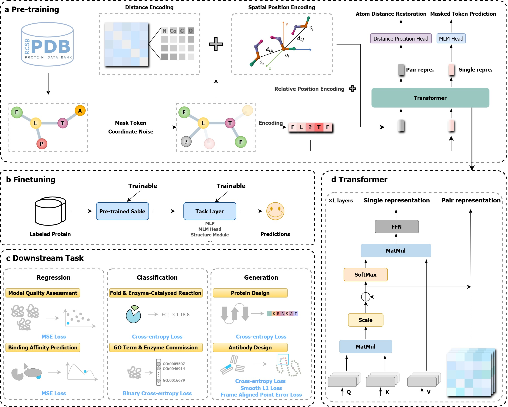

# Sable: Bridging the Gap in Protein Structure Understanding with an Empowering and Versatile Pre-training Paradigm

**Sable** is an open-source representation learning framework for protein.

Leveraging the power of [OpenComplex](https://github.com/baaihealth/OpenComplex), **Sable** explores the path of self-supervised sequence-structure collaborative learning, and demonstrates its efficiency on vast downstream tasks.



## Environment

Existing experiments of **Sable** were successfully ran on [Tesla V100-PCIE-32GB](https://www.nvidia.com/en-gb/data-center/tesla-v100/), in the [NVIDIA container image 23.09](https://docs.nvidia.com/deeplearning/frameworks/pytorch-release-notes/rel-23-09.html) docker container for convenience

It is straightforward to prepare the environment running **Sable**. In the context of `conda`[^1], simply execute following commands will prepare the environment well (assume the environemnt name is _`sable`_)
```bash
conda create -y -n sable python=3.10
conda activate sable
conda env update --file environment.yml --prune
```

## Usage

Before executing commands for different tasks, please ensure that shell varible _`PROJECT_ROOT`_ is set as the root for the project (please use **absolute path** here to avoid potential ambiguity)
```bash
export PROJECT_ROOT=/path/to/project/root
```

In order to make a quick run and have an intuitive understanding on the data, this project provides example datasets available for all experiments as [example_data.tar.gz](./example_data.tar.gz), which contains 2 datapoints for each. Users can decompress and use it
```bash
tar zxvf example_data.tar.gz
```
* Training, validation, and test data files have specific names as `train.lmdb`, `eval.lmdb`, and `test.lmdb`. They are constructured as [lmdb](https://lmdb.readthedocs.io/) files and have consistent formats. Each datapoint is represented as a `dict` serialized by [pickle](https://docs.python.org/3/library/pickle.html) through `pickle.dumps`

Two important paths should be specified in **`sable/config/sable.yaml`** before running experiments (please use **absolute path** here to avoid potential ambiguity)
* _`paths.data_dir`_: the root directory for training, validation, and test data
    * The **`example_data`** directory decompressed could be used directly here
* _`paths.log_dir`_: the root directory for output (such as checkpoints) and log files

Training, fine-tuning, and testing in **Sable** is consistent by executing the main script `go_sable.py`, configured by [Hydra](https://hydra.cc/)
* some useful arguments that could be overwritten in the command line to adapt to users' environment. For example, to run a pre-training with batch size (_`data.batch_size`_) 2, 2 GPU devices (_`trainer.devices`_), 40 epochs (_`trainer.max_epochs`_), and stop wandb from uploading logs (_`logger.wandb.offline`_), the command looks like
```bash
python go_sable.py data.batch_size=2 trainer.devices=2 trainer.max_epochs=40 logger.wandb.offline=True
```

To show the efficiency of **Sable**, six downstream tasks are selected to cover most common task categories: generation, classification, and regression. They are
<table style="text-align: center">
    <thead>
        <tr>
            <th>Category</th>
            <th>Task Name</th>
        </tr>
    </thead>
    <tbody>
        <tr>
            <td rowspan=2>Classification</td>
            <td>Enzyme-catalyzed Reaction Classification</td>
        </tr>
        <tr>
            <td>Fold Classification</td>
        </tr>
        <tr>
            <td rowspan=2>Generation</td>
            <td>Antibody Design</td>
        </tr>
        <tr>
            <td>Protein Design</td>
        </tr>
        <tr>
            <td rowspan=2>Regression</td>
            <td>Binding Affinity</td>
        </tr>
        <tr>
            <td>Model Quality Assessment</td>
        </tr>
    </tbody>
</table>

The values for _`run`_ argument are the same as filenames (without extension) in subfolder **`sable/config/run/`**
<details>
<summary>Here is the list of names for tasks</summary>
<pre>
sable/config/run/
├── antibody_design.yaml
├── binding_affinity.yaml
├── enzyme-catalyzed_reaction_classification.yaml
├── fold_classification.yaml
├── model_quality_assessment.yaml
├── protein_design.yaml
└── sable.yaml
</pre>
</details>

The training of different downstream tasks and datasets could be specified by adding _`run`_ and _`dataset`_ argument. For example on antibody design task's RAbD dataset
```bash
python go_sable.py run=antibody_design dataset=RAbD
```

The further descriptions of data format for each task are included in [Experiment.md](./Experiment.md)

## License and Disclaimer

Copyright 2025 Beijing Academy of Artificial Intelligence (BAAI).

Base on OpenComplex, **Sable** is licensed under the permissive Apache License, Version 2.0.

## Contributing

If you encounter problems using **Sable**, feel free to create an issue!

We also welcome pull requests from the community.

## Citation

If you found our work useful or interesting, please consider citing our paper:

```bibtex
@article{10.1093/bib/bbaf120,
    author = {Li, Jiashan and Chen, Xi and Huang, He and Zeng, Mingliang and Yu, Jingcheng and Gong, Xinqi and Ye, Qiwei},
    title = {\$\\mathcal\{S\}\$able: bridging the gap in protein structure understanding with an empowering and versatile pre-training paradigm},
    journal = {Briefings in Bioinformatics},
    volume = {26},
    number = {2},
    pages = {bbaf120},
    year = {2025},
    month = {03},
    abstract = {Protein pre-training has emerged as a transformative approach for solving diverse biological tasks. While many contemporary methods focus on sequence-based language models, recent findings highlight that protein sequences alone are insufficient to capture the extensive information inherent in protein structures. Recognizing the crucial role of protein structure in defining function and interactions, we introduce \$\\mathcal\{S\}\$able, a versatile pre-training model designed to comprehensively understand protein structures. \$\\mathcal\{S\}\$able incorporates a novel structural encoding mechanism that enhances inter-atomic information exchange and spatial awareness, combined with robust pre-training strategies and lightweight decoders optimized for specific downstream tasks. This approach enables \$\\mathcal\{S\}\$able to consistently outperform existing methods in tasks such as generation, classification, and regression, demonstrating its superior capability in protein structure representation. The code and models can be accessed via GitHub repository at https://github.com/baaihealth/Sable.},
    issn = {1477-4054},
    doi = {10.1093/bib/bbaf120},
    url = {https://doi.org/10.1093/bib/bbaf120},
    eprint = {https://academic.oup.com/bib/article-pdf/26/2/bbaf120/62822310/bbaf120.pdf},
}
```

**NOTE**: This repository is migrated from the original implementation, to get rid of debugging codes and extra routines working on adapting internal running environment for better hardware performance. In this repository:
* The whole model architecture, as well as important components such as LR scheduler, metrics, etc., are migrated intactly
* Scripts for generating datasets are included under **`scripts/`** subfolder to help reproduce results. Note that some of them are still updating (such as the SAbDab), newly generated data may have slight difference
* The implementations of multi-label classification tasks will be opened in the future updates
* We will release data such as datasets and weights in the future.

[^1]: The command and script names are `in code block`, argument and variables names are _`italic in code block`_, and paths are **`bold in code block`**

